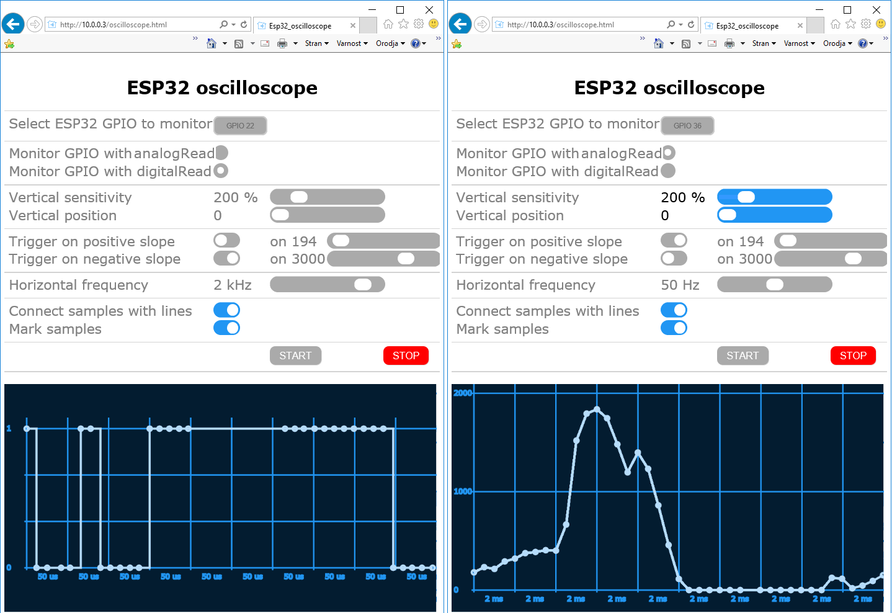

# ESP32 oscilloscope with Web user interface - see the signals the way ESP32 sees them

The first picture below was generated by bouncing of an end switch. ESP32 Oscilloscope performed digitalRead-s after pin has been initialised in INPUT_PULLUP mode. The second picture shows noise coming from poorly regulated power supply. ESP32 Oscilloscope used analogRead-s on an unconnected pin.



ESP32 oscilloscope is build upon Esp32_web_ftp_telnet_server_template (https://github.com/BojanJurca/Esp32_web_ftp_telnet_server_template) and is also fully included there in case you are more interested in the whole project. Here are only those functionalities that are needed for oscilloscope to work:

- **webServer** for HTTP and WS requests (oscilloscope uses WebSockets).

- **ftpServer** for uploading oscilloscope.html to ESP32 (it uses SPIFFS file system).

## Setup instructions

1. Copy all files in this package into Esp32_oscilloscope directory.
2. Open Esp32_oscilloscope.ino with Arduino IDE.
3. Find and change YOUR-STA-SSID to your WiFi SSID and YOUR-STA-PASSWORD to your WiFi password.
4. Compile sketch and run it on your ESP32 for the first time. Doing this, ESP32 flash memory will be formatted with SPIFFS file system. WARNING: every information you have stored into ESP32’s flash memory will be lost.
5. FTP to your ESP32 and upload the following files into /var/www/html/ directory:

   - android-192.png,
   - apple-180.png,
   - oscilloscope.html.

```
C:\esp32_oscilloscope>ftp YOUR-ESP32-IP
Connected to 10.0.0.3.
220-ESP32 FTP server - everyone is allowed to login
User (10.0.0.3:(none)):
331 enter password
Password:
230 logged on, use "/" to refer to your home directory "/"
ftp> put android-192.png /var/www/html/android-192.png
226 /var/www/html/android-192.png transfer complete
ftp> put apple-180.png /var/www/html/apple-180.png
226 /var/www/html/apple-180.png transfer complete
ftp> put oscilloscope.html /var/www/html/oscilloscope.html
226 /var/www/html/oscilloscope.html transfer complete
ftp> ls
200 port ok
150 starting transfer
-r-xr-xrwx   1 owner    group            1818 Aug 24 10:47      /var/www/html/android-192.png
-r-xr-xrwx   1 owner    group            1596 Aug 24 10:47      /var/www/html/apple-180.png
-r-xr-xrwx   1 owner    group           39515 Aug 24 10:47      /var/www/html/oscilloscope.html
226 transfer complete
ftp>
```

6. Open http://YOUR-ESP32-IP/oscilloscope.html with your browser.
